**An end-to-end analysis of why fewer women participate in India's labour force than men, and whether that gap shifts with geography, education, and state wealth — built on real PLFS 2023-24 government microdata (3,19,773 working-age respondents), from raw SQL cleaning through a 13-page interactive Power BI dashboard.**

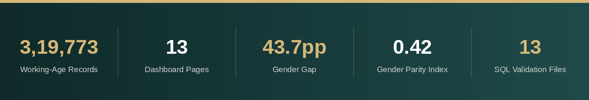

   

---

## 1. Business Understanding

<table border="2" style="border-collapse: collapse; border: 2px solid #102A2A;">
<tr>
<td style="border: 2px solid #102A2A; padding: 10px; background-color:#102A2A; color:white; width:20%;"><b>The problem</b></td>
<td style="border: 2px solid #102A2A; padding: 10px;">Millions of capable Indian women remain outside the paid workforce. Policymakers need to know where the gap is worst, and which levers actually move it.</td>
</tr>
<tr>
<td style="border: 2px solid #102A2A; padding: 10px; background-color:#102A2A; color:white;"><b>Why it's hard</b></td>
<td style="border: 2px solid #102A2A; padding: 10px;">Labour force data is messy at scale (4+ lakh raw records, non-standard status codes, banded values) — easy to oversimplify without state and demographic breakdowns.</td>
</tr>
<tr>
<td style="border: 2px solid #102A2A; padding: 10px; background-color:#102A2A; color:white;"><b>The question</b></td>
<td style="border: 2px solid #102A2A; padding: 10px;"><i>Why are fewer women working compared to men in India, and does this gap change based on where they live, how educated they are, and how rich their state is?</i></td>
</tr>
</table>

---

## 2. Data Understanding

**Sources:** All three datasets are official Government of India sources.

<table border="2" style="border-collapse: collapse; border: 2px solid #102A2A;">
<tr style="background-color:#102A2A; color:white;">
<th style="border: 2px solid #102A2A; padding: 8px;">Dataset</th>
<th style="border: 2px solid #102A2A; padding: 8px;">Source</th>
</tr>
<tr>
<td style="border: 2px solid #102A2A; padding: 8px;"><b>PLFS 2023-24</b> (Person-Level, Visit 1)</td>
<td style="border: 2px solid #102A2A; padding: 8px;">MoSPI, National Statistics Office — microdata.gov.in</td>
</tr>
<tr>
<td style="border: 2px solid #102A2A; padding: 8px;"><b>State Rural Literacy Rate</b> 2019-24</td>
<td style="border: 2px solid #102A2A; padding: 8px;">data.gov.in</td>
</tr>
<tr>
<td style="border: 2px solid #102A2A; padding: 8px;"><b>State GSDP Per Capita Income</b> 2019-24</td>
<td style="border: 2px solid #102A2A; padding: 8px;">data.gov.in</td>
</tr>
</table>

**Scale:** 4,18,159 raw person-level records × 139 columns, trimmed to 26 relevant columns, then filtered to 3,19,773 working-age (15+) respondents.

**Early red flags:**
- `State_Code` is a numeric NSSO code, not a name — no direct join possible without a lookup table
- `Employment_Status_Code` uses non-standard codes (e.g. code 81 = "Unemployed (Sought/Available for Work)"), not standard NSS 71/72 codes
- `Duration_Unemployment_Spell` is stored as banded codes (1–5), not raw durations
- Two support tables had rows fail import due to `'NA'` text in numeric fields, plus real state-name typos (`'Meghalava'` → Meghalaya, `'Chhatisgarh'` → Chhattisgarh)

---

## 3. Data Preparation

**Pipeline:** MySQL Workbench → Power Query → Power BI Desktop + DAX

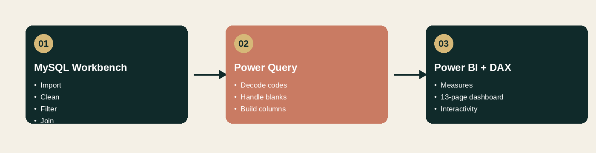

**SQL (heavy lifting on the full 4+ lakh rows before Power BI touches it):**
- Built `plfs_2023_2024_cleaned_person_level_data` (26 selected, renamed columns) from the raw 139-column file
- Filtered to working age with `CREATE TABLE plfs_working_age AS SELECT * WHERE Age >= 15` → 3,19,773 rows (98,386 under-15 records excluded)
- Built a custom `state_code_lookup` table (36 rows) to map PLFS's numeric state codes to names
- Cross-checked state names across the Literacy and GSDP tables with `NOT IN`, found 11 mismatches — 9 legitimately absent UTs, 2 real typos, fixed via `UPDATE`
- Joined `plfs_working_age` + `state_code_lookup` + Literacy + GSDP into one analysis-ready table

**🔍 What I caught:**

<table border="2" style="border-collapse: collapse; border: 2px solid #102A2A;">
<tr style="background-color:#102A2A; color:white;">
<th style="border: 2px solid #102A2A; padding: 8px;">Issue</th>
<th style="border: 2px solid #102A2A; padding: 8px;">Problem</th>
<th style="border: 2px solid #102A2A; padding: 8px;">Fix</th>
</tr>
<tr>
<td style="border: 2px solid #102A2A; padding: 8px;">Import blocked</td>
<td style="border: 2px solid #102A2A; padding: 8px;"><code>local_infile disabled</code> error on the large PLFS CSV</td>
<td style="border: 2px solid #102A2A; padding: 8px;"><code>SET GLOBAL local_infile=1</code> + Workbench <code>OPT_LOCAL_INFILE=1</code> + app restart</td>
</tr>
<tr>
<td style="border: 2px solid #102A2A; padding: 8px;">Silent file access failure</td>
<td style="border: 2px solid #102A2A; padding: 8px;">OneDrive-synced folder blocked <code>LOAD DATA LOCAL INFILE</code></td>
<td style="border: 2px solid #102A2A; padding: 8px;">Pre-trimmed the CSV to 26 columns and used the GUI Table Data Import Wizard instead</td>
</tr>
<tr>
<td style="border: 2px solid #102A2A; padding: 8px;">Bad numeric imports</td>
<td style="border: 2px solid #102A2A; padding: 8px;">Chandigarh & Daman and Diu literacy rows failed — <code>'NA'</code> text in DECIMAL columns</td>
<td style="border: 2px solid #102A2A; padding: 8px;">Manual <code>INSERT</code> using proper <code>NULL</code> values</td>
</tr>
<tr>
<td style="border: 2px solid #102A2A; padding: 8px;">Two imports running at once</td>
<td style="border: 2px solid #102A2A; padding: 8px;">Triggered a "prepared statement" error</td>
<td style="border: 2px solid #102A2A; padding: 8px;">Ran imports one at a time</td>
</tr>
</table>

**Power Query:** decoded numeric codes into labels (Gender 1 → Male, 2 → Female), handled remaining blanks, engineered `Current_Attendance_Group` (32 raw codes grouped into 4 buckets).

---

## Dashboard Preview

13 pages, built as a guided story — the same structure the dashboard's own Home page navigates by.

### 🏠 Home
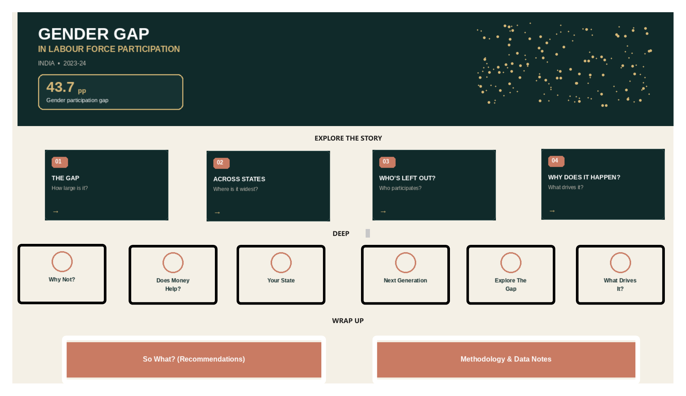
The landing page states the headline number immediately — a 43.7pp gender gap — then lays out the rest of the dashboard as clickable story cards grouped into "Explore the Story," "Deep Dive," and "Wrap Up." A first-time viewer can click through in order with no instructions needed.

### Explore the Story

<table>
<tr>
<td width="50%">

**1 · The Gap**
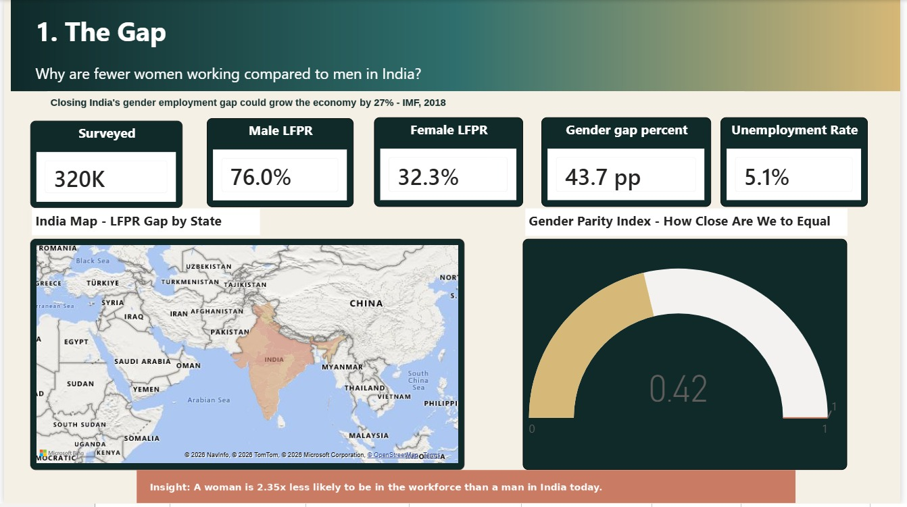
Sets the national baseline: 76.0% of men work vs. 32.3% of women, a 43.7pp gap, and a Gender Parity Index of 0.42. A choropleth map shows the gap by state alongside a sourced IMF stat on the economic cost of the gap.
> **A woman is 2.35x less likely to be in the workforce than a man in India today.**

</td>
<td width="50%">

**2 · Across States**
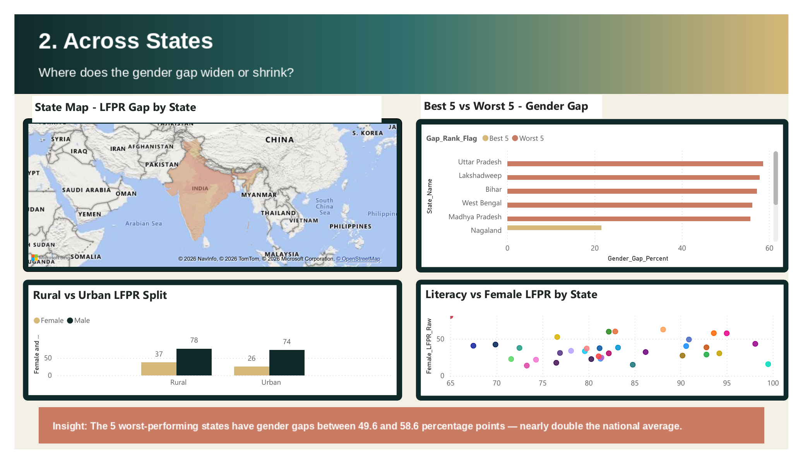
Ranks every state by gender gap size. The worst five — Uttar Pradesh, Lakshadweep, Bihar, West Bengal, Madhya Pradesh — all exceed 55pp, roughly double the best performers. A rural-vs-urban split reveals a counter-intuitive twist: cities show a *wider* gap than villages.
> **The 5 worst states have gaps nearly double the national average — 49.6–58.6pp.**

</td>
</tr>
<tr>
<td width="50%">

**3 · Who's Left Out**
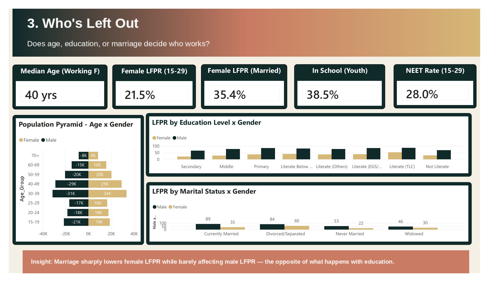
Breaks the gap down by age, education, and marital status. Only 21.5% of women aged 15–29 participate, and a population pyramid plus marital-status chart set up the project's central discovery, explored fully on Page 5.
> **Marriage sharply lowers female LFPR — education does the opposite.**

</td>
<td width="50%">

**4 · Working, But How?**
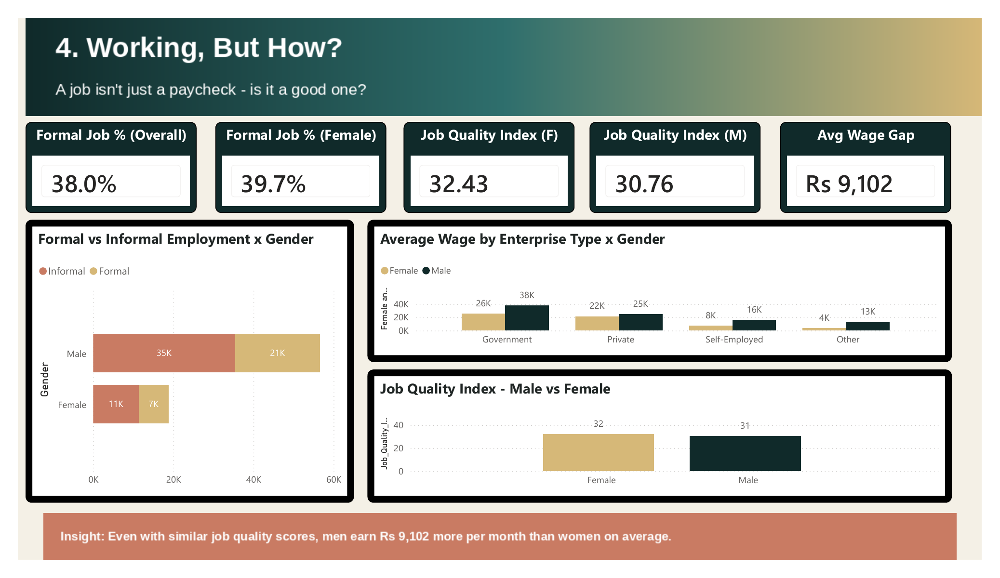
Having a job isn't the same as having a *good* job — only 38% of employed people have formal benefits like paid leave. The wage gap holds at ₹9,102/month in men's favor across every enterprise type, even though women's jobs score marginally higher on non-wage quality.
> **Same job quality score, but men earn ₹9,102 more per month.**

</td>
</tr>
</table>

### Deep Dive

<table>
<tr>
<td width="50%">

**5 · Why Not?**
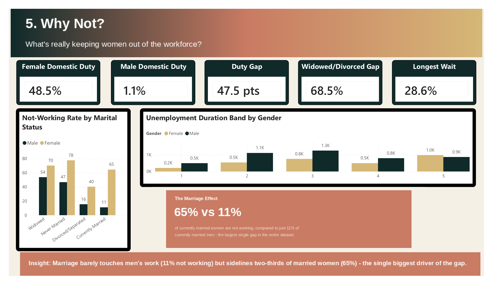
Investigates why women aren't working. Domestic duty accounts for 48.5% of women's non-working status vs. just 1.1% for men. The page's headline finding, "The Marriage Effect," is stated directly and becomes the project's central conclusion.
> **65% of married women aren't working, vs. 11% of married men — the single biggest gap in the dataset.**

</td>
<td width="50%">

**6 · Does Money Help?**
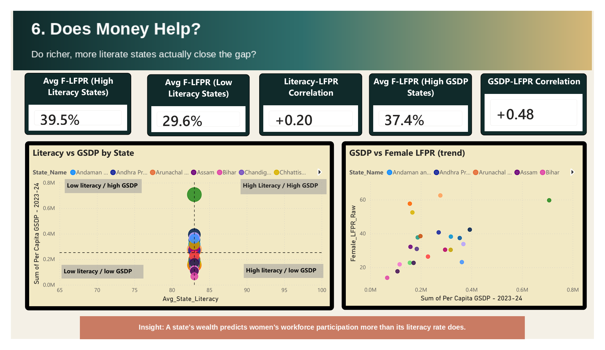
Tests whether wealthier or more literate states show smaller gaps. State income (GSDP) correlates with female LFPR more than twice as strongly as literacy does — suggesting job access matters more than education once a baseline is reached.
> **A state's wealth predicts female participation more than its literacy rate.**

</td>
</tr>
<tr>
<td width="50%">

**7 · Your State**
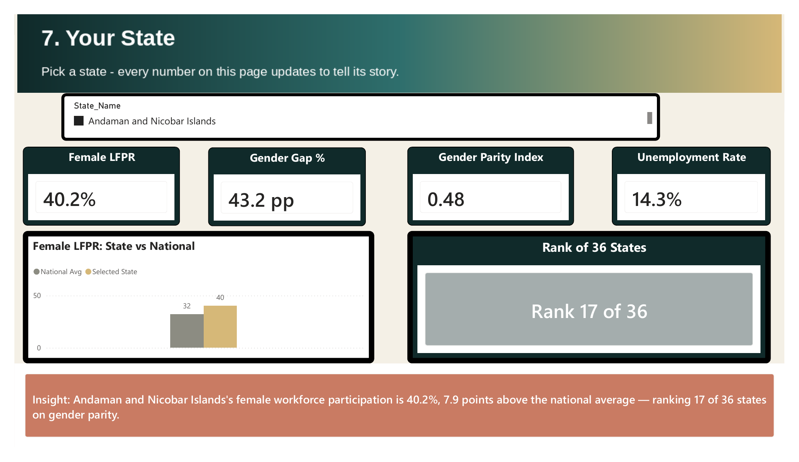
The drill-through landing page — selecting any of 36 states/UTs updates every card and chart to tell that state's specific story, including its live rank on gender parity. Defaults to a Telangana view as a personal home-state touch.
> **Pick any of 36 states — every number on the page updates live.**

</td>
<td width="50%">

**8 · Next Generation**
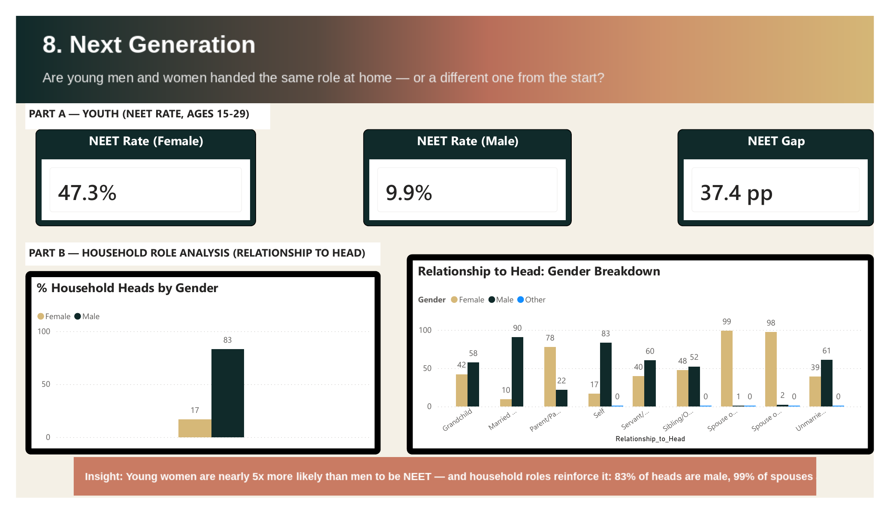
Looks at youth and household structure together. Nearly half of young women are NEET (not working, studying, or training) vs. 1 in 10 young men, and 83% of household heads recorded in the survey are male.
> **Young women are 5x more likely than men to be NEET. 83% of household heads are male.**

</td>
</tr>
<tr>
<td width="50%">

**9 · Explore the Gap**
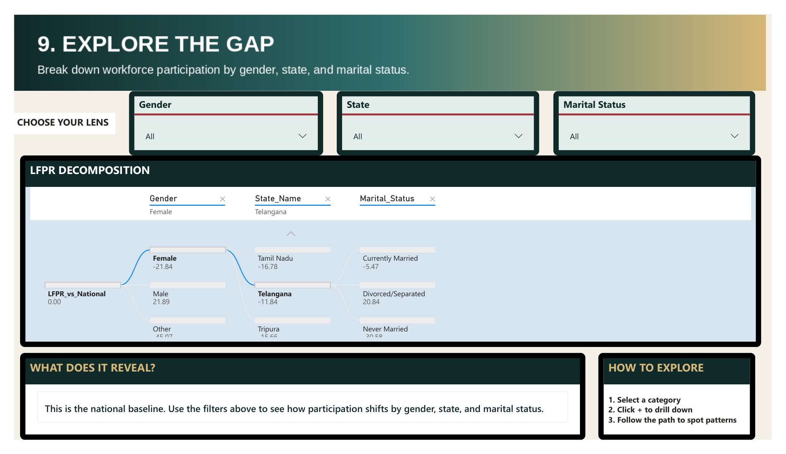
The free-exploration page — a decomposition tree lets a viewer break down participation by gender, then state, then marital status, in any order, discovering the same compounding effects the rest of the dashboard describes.
> **A free-form decomposition tree — break down the gap by gender, state, or marital status in any order.**

</td>
<td width="50%">

**10 · What Drives It**
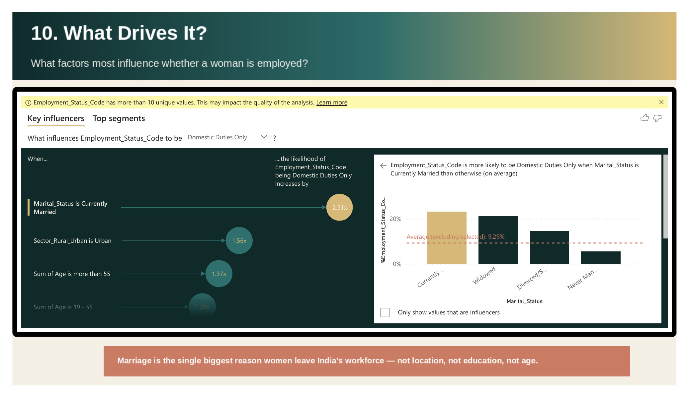
Runs Power BI's Key Influencers AI model — entirely independent of any hand-built DAX measure — to ask what most increases the odds a woman is recorded as "Domestic Duties Only." The answer: marriage, by a wide margin, serving as a second, statistically independent confirmation of Page 5's finding.
> **Power BI's AI model independently confirms marriage as the #1 driver — not location, not education, not age.**

</td>
</tr>
</table>

### Wrap Up

<table>
<tr>
<td width="50%">

**So What? — Recommendations**
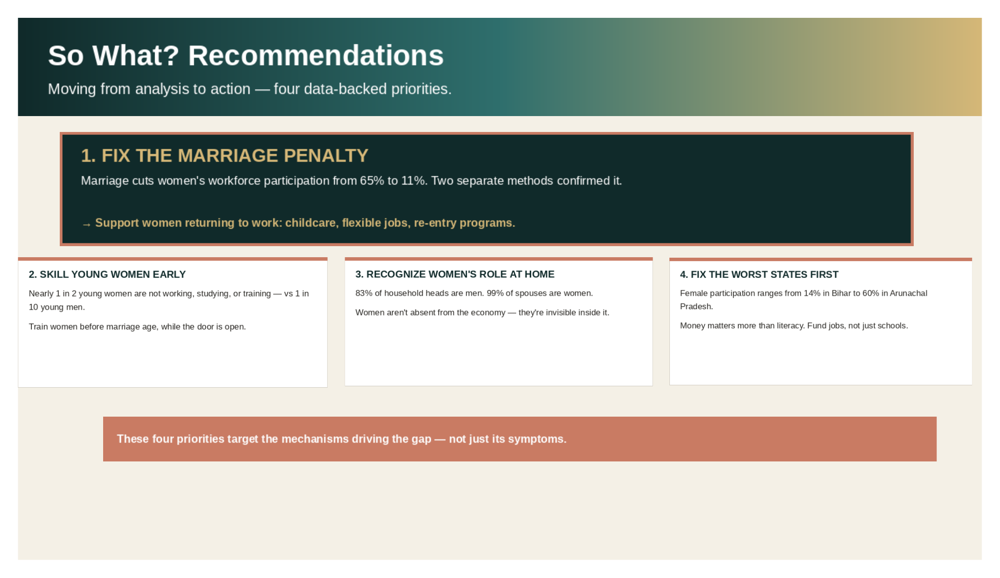
Closes with four concrete, data-backed priorities: fix the marriage penalty, skill young women early, recognize women's unpaid household role, and fix the worst states first — moving the project from analyst to advisor-level thinking.
> **Four priorities aimed at the mechanisms driving the gap — not just its symptoms.**

</td>
<td width="50%">

**Methodology & Data Notes**
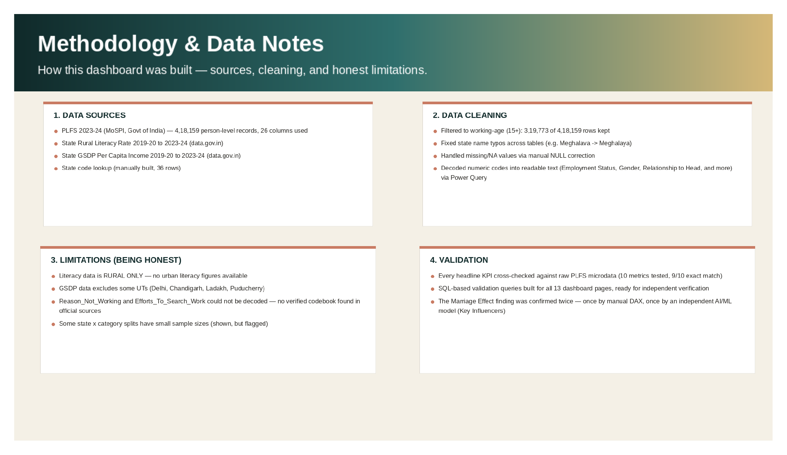
Documents, inside the dashboard itself, exactly how it was built — sources, cleaning steps, honest limitations, and validation results — so anyone viewing it without this README can still judge how much to trust it.
> **Sources, cleaning steps, and honest limitations — documented inside the dashboard itself.**

</td>
</tr>
</table>

---

## 4. Methodology

**DAX measure design, and the gotchas behind it:**

- Every display measure (`FORMAT() & "%"`) is paired with a separate raw numeric measure — text-formatted measures silently break downstream arithmetic if reused
- Benchmark measures inside `FILTER` loops are wrapped in `CALCULATE(ALL())` to stop per-row recalculation
- Rank flags use `FILTER`/`COUNTROWS` rather than `RANKX`, which was silently mis-tagging states — plus a `HasData` guard to exclude zero-respondent states like Dadra & Nagar Haveli post-merger
- `Formal_Job_Percent` uses OR logic (paid leave **or** social security), not AND, since either qualifies as a formal-job indicator

**Dashboard build:** 13 pages (Home, 10 analysis pages, "So What?" Recommendations, Methodology & Data Notes), Story Mode bookmarks for guided walkthrough, a What-if State Report Card with a Telangana home-state spotlight, Key Influencers analysis, and a Decomposition Tree for click-through root-cause exploration.

---

## 5. Key Findings

<table>
<tr>
<td width="50%">

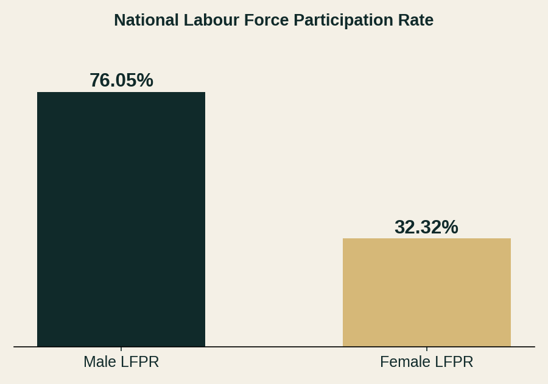

**1. The national gender gap is large and structural**
Female LFPR: **32.32%** vs. Male LFPR: **76.05%** — a **43.7 percentage point gap**, and a Gender Parity Index of **0.42**.

</td>
<td width="50%">

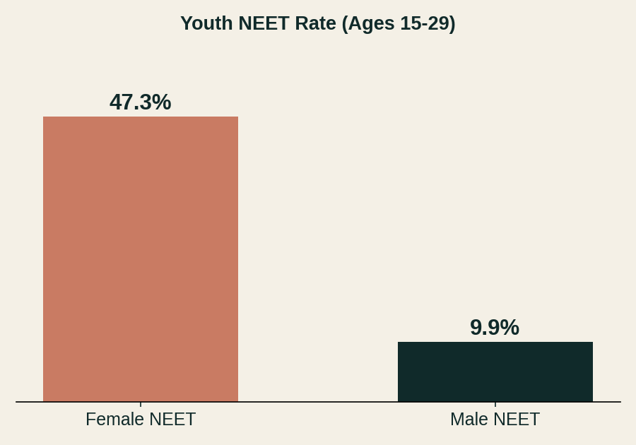

**2. Youth disengagement (NEET) is heavily gendered**
Young women are close to **5x** more likely than young men to be not in employment, education, or training.

</td>
</tr>
<tr>
<td width="50%">

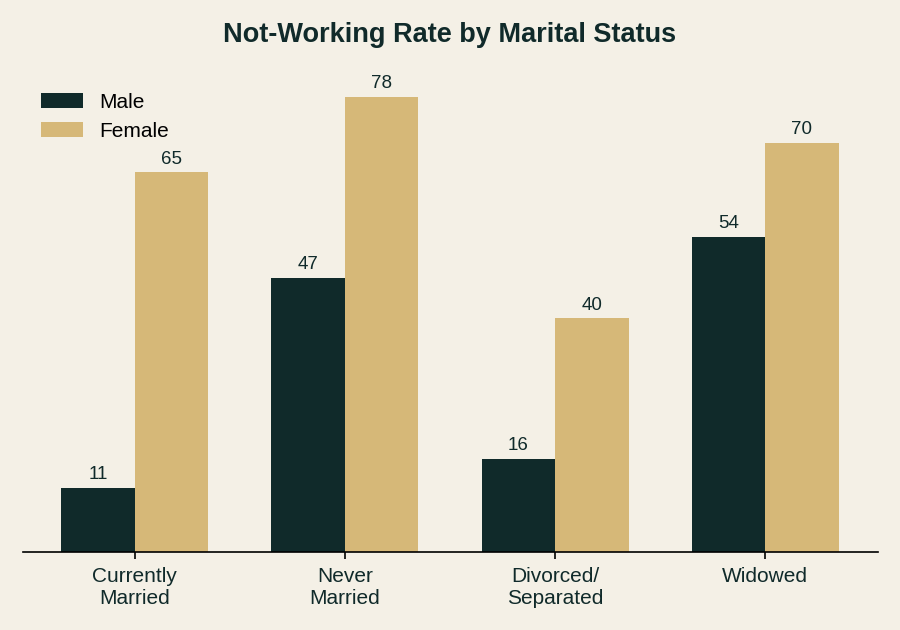

**3. Marriage is the single strongest factor keeping women out of work**
"Currently Married" carries a **2.51x** weight in the Key Influencers analysis — the top factor associated with non-participation, confirmed independently by two separate methods.

</td>
<td width="50%">

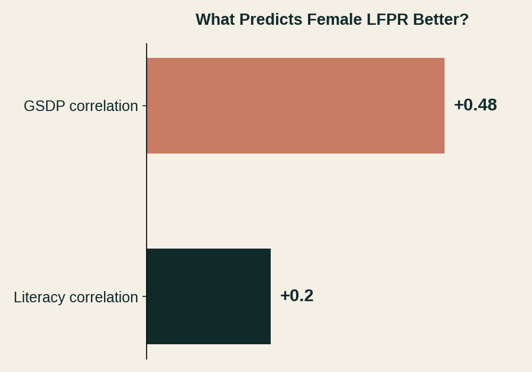

**4. State wealth predicts participation better than literacy**
GSDP correlation (**+0.48**) is more than double the literacy correlation (**+0.20**) with female LFPR.

</td>
</tr>
</table>

**5. Household roles reflect the same imbalance** — 83.3% of household heads are male; 99.2% of "Spouse of Head" entries are female.

**Home state (Telangana):** Female LFPR 42.3% (rank 9/36), Gender Parity Index 0.55, Unemployment 6.1% — better than the national average but still far from parity.

---

## Validation and Quality Assurance

- 10 headline dashboard metrics (national LFPR, Gender Parity Index, both correlations, NEET rate/gap, household headship split, domestic-duty gap) were independently recalculated from the raw PLFS CSV — 9 of 10 matched exactly
- The project's central finding — the **Marriage Effect** — was confirmed twice through methods that share no calculation logic: once via a manually built DAX measure, once via Power BI's Key Influencers AI visual arriving at the same conclusion independently
- One metric (longest unemployment-duration band) could not be reproduced from raw columns and is documented as a limitation rather than corrected silently

---

## 6. Business Impact / Recommendations

1. **Target interventions at married women specifically** — the largest single lever identified in the Key Influencers analysis, ahead of education or location
2. **Don't treat literacy as the primary policy lever for female employment** — state economic opportunity (GSDP) tracks participation more strongly
3. **Address the NEET gap early** — a near 5x gender gap in youth disengagement compounds into the adult LFPR gap
4. **Use state-level targeting, not one national policy** — Gender Parity Index varies enough across states (e.g. Telangana's 0.55 vs. the national 0.42) that a single blanket approach will under- or over-shoot in different states

---

## Skills Demonstrated

- End-to-end pipeline design across three tools (MySQL → Power Query → Power BI/DAX) on a 4+ lakh row government dataset
- Multi-table joins requiring a custom-built lookup table (numeric state codes with no direct text match)
- DAX measure design accounting for text-vs-numeric formatting pitfalls and row-context recalculation bugs
- Data integrity investigation — flagging non-standard codebooks and banded fields rather than assuming clean data
- Story Mode / bookmark-based presentation design for a guided, interview-ready dashboard walkthrough
- Correcting a validation claim after review to keep only accurate, evidence-backed statements in the final deliverable

---

## Challenges & What I Learned

**SQL import friction came before any real analysis could start**
- `local_infile` restrictions and a OneDrive file-lock both blocked the most direct import path
- Rather than forcing the original method, switched to a pre-trimmed CSV + GUI import wizard — a smaller, more reliable path to the same result

**A validation claim didn't hold up under review, and got corrected rather than kept**
- An earlier draft of the Methodology page implied first-person Python/SQL cross-checks that hadn't actually been done that way
- Revised the text once this was caught, rather than leaving an inaccurate claim in a portfolio piece

**Two numbers that looked contradictory were actually two different populations, not an error**
- NEET rate appeared as both 28.0% and 47.3% in different places — traced to different age/population definitions, not a calculation mistake

---

## Limitations

- Literacy data is **rural-only** — no urban literacy comparison is possible with this dataset
- GSDP data covers only 28 major states/UTs — smaller UTs (Delhi, Chandigarh, Ladakh, Puducherry) are excluded from wealth-correlation analysis
- `Reason_Not_Working` and `Efforts_To_Search_Work` have no verified public codebook — retained as numeric with a methodology note rather than guessed labels
- This is an **observational, descriptive analysis** — relationships identified (e.g. marriage, GSDP) reflect correlation, not confirmed causation
- Some state-by-category breakdowns, particularly for smaller states/UTs, rest on small sample sizes and should be read with appropriate caution

---

## Future Improvements

- Pull an earlier PLFS round (2019-20) for a genuine before/after time comparison
- District-level hotspot analysis within the highest-gap states
- A proper codebook reconciliation for `Reason_Not_Working` if an official source becomes available
- Mobile-optimized Power BI phone layout for the dashboard

---

## Acknowledgements

Grateful to the faculty and mentors at **Imarticus Learning** for their guidance throughout this capstone, and to **MoSPI** and **data.gov.in** for maintaining open, high-quality public datasets that make independent analysis like this possible.

---

**⭐ If this project was useful or interesting, consider starring the repo!**

*This project was completed as part of the Data Analytics Program at Imarticus Learning.*

**Sindhu Sharma Marupaka**
[GitHub](https://github.com/sindhusharmamarupaka) 

